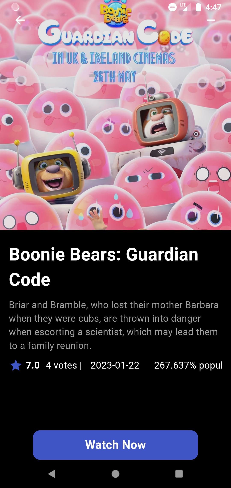
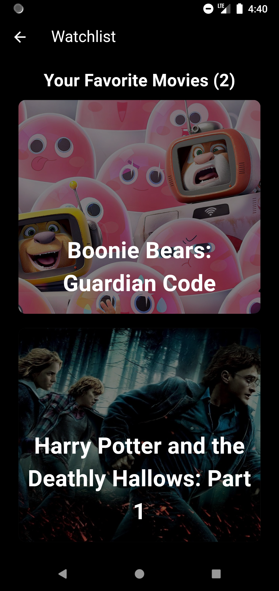
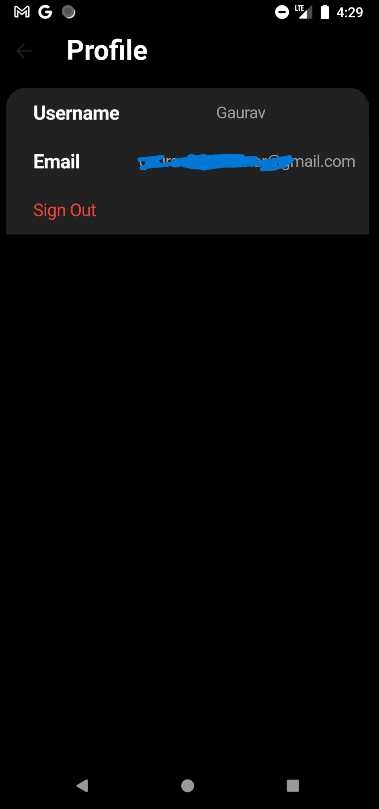

# 🎬 Movie App


## 🌟 Features

- Browse popular movies
- Search for movies
- Add movies to watchlist
- View detailed information about a movie
- Category wise movie listing

## 🛠️ Tech Stack

- Flutter
- Firebase
- TMDB API

## 📸 Screenshots

| Home Screen | Search Screen | Movie Details |
|-------------|---------------|---------------|
|  |  |  |

| Watchlist | Profile | Splash |
|-------------|---------------|---------------|
|  |  |  |


## 🚀 Getting Started

1. Clone the repo
    ```sh 
    git clone https://github.com/ProgrammingWithGaurav/Flixify_Movie_App